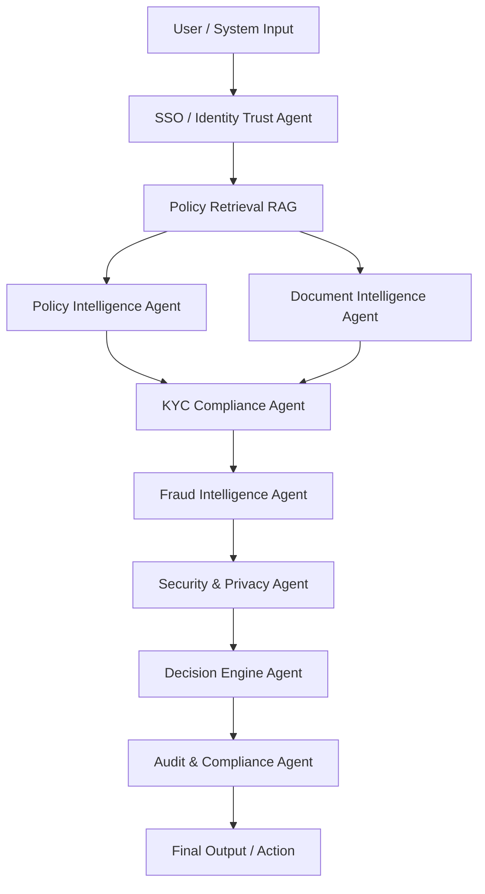

# 🏦 Banking Fraud Defense & Compliance Intelligence Platform

### 🚀 Enterprise Multi-Agent LangGraph System + Azure OpenAI

This platform is a **production-style Banking Intelligence System**, not a chatbot.  
It delivers **Fraud Defense, Compliance Automation, Secure KYC Decisions, Policy Enforcement & Governance Intelligence** using:

✔ Multi-Agent Architecture  
✔ Secure Retrieval Augmented Generation (RAG)  
✔ Deterministic LangGraph Workflows  
✔ Azure OpenAI (Bank-secure)  
✔ JSON-Based Machine Intelligence

---

## 🧠 What This Platform Does

This platform acts like a **virtual intelligence workforce inside a bank**, capable of:

- Understanding Banking Policies
- Reading and Validating Documents
- Enforcing KYC / KYB Compliance
- Detecting Fraud Risk Signals
- Applying Security & Privacy Guardrails
- Trust Validating Users via SSO Controls
- Making Final Banking Decisions
- Generating Regulator-Ready Audit Logs

This is built for:
**Banks | Financial Institutions | Compliance Teams | Risk & Fraud Units | AI Innovation Programs**

---

## 🧩 Multi-Agent Architecture

### Core Intelligence

- 🧠 Policy Intelligence Agent
- 📄 Document Intelligence Agent

### Compliance & Risk

- 🛡️ KYC / KYB Compliance Agent
- 🔍 Fraud Intelligence Agent

### Security & Trust

- 🔐 Security & Privacy Enforcement Agent
- 🔑 SSO / Identity Trust Agent

### Governance & Execution

- ⚖️ Decision Engine Agent
- 📜 Audit & Compliance Logging Agent

---

## 🏗 Architecture Diagram

### High-Level Flow

User Request
↓
Identity Trust (SSO)
↓
Policy Retrieval (RAG)
↓
Policy Intelligence
Document Intelligence
↓
KYC Compliance ───────► Fraud Intelligence ───────► Security Agent
↓
Decision Engine
↓
Audit & Compliance Logs
↓
Final Secure Output

---

### Mermaid Diagram

