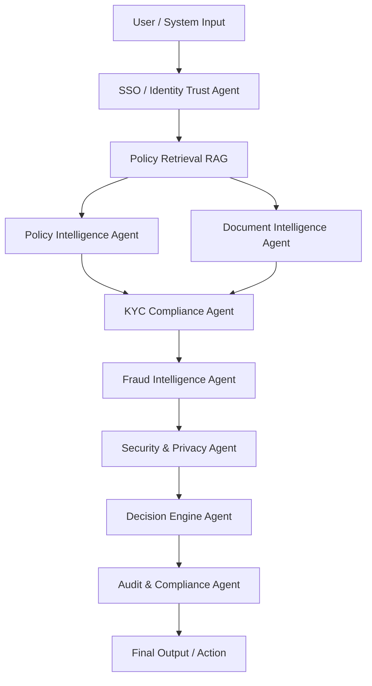

# 🏦 Banking Fraud Defense & Compliance Intelligence Platform

### 🚀 Enterprise Multi-Agent LangGraph System + Azure OpenAI


This platform is a **production-style Banking Intelligence System**, not a chatbot.  
It delivers **Fraud Defense, Compliance Automation, Secure KYC Decisions, Policy Enforcement & Governance Intelligence** using:

✔ Multi-Agent Architecture  
✔ Secure Retrieval Augmented Generation (RAG)  
✔ Deterministic LangGraph Workflows  
✔ Azure OpenAI (Bank-secure)  
✔ JSON-Based Machine Intelligence  

---

## 🧠 What This Platform Does

This platform acts like a **virtual intelligence workforce inside a bank**, capable of:

- Understanding Banking Policies
- Reading and Validating Documents
- Enforcing KYC / KYB Compliance
- Detecting Fraud Risk Signals
- Applying Security & Privacy Guardrails
- Trust Validating Users via SSO Controls
- Making Final Banking Decisions
- Generating Regulator-Ready Audit Logs

This is built for:
**Banks | Financial Institutions | Compliance Teams | Risk & Fraud Units | AI Innovation Programs**

---

## 🧩 Multi-Agent Architecture

### Core Intelligence
- 🧠 Policy Intelligence Agent  
- 📄 Document Intelligence Agent  

### Compliance & Risk
- 🛡️ KYC / KYB Compliance Agent  
- 🔍 Fraud Intelligence Agent  

### Security & Trust
- 🔐 Security & Privacy Enforcement Agent  
- 🔑 SSO / Identity Trust Agent  

### Governance & Execution
- ⚖️ Decision Engine Agent  
- 📜 Audit & Compliance Logging Agent  

---

## 🏗 Architecture Diagram

### High-Level Flow

User Request  
↓  
Identity Trust (SSO)  
↓  
Policy Retrieval (RAG)  
↓  
Policy Intelligence  
Document Intelligence  
↓  
KYC Compliance ───────► Fraud Intelligence ───────► Security Agent  
↓  
Decision Engine  
↓  
Audit & Compliance Logs  
↓  
Final Secure Output  

---

### Mermaid Diagram



---

## ⚙️ Technology Stack

### Backend
- Python 3.10+
- FastAPI
- LangChain
- LangGraph
- Azure OpenAI
- Secure Structured JSON Decisioning
- Persistent Banking Audit Logging

### Frontend
- Next.js
- React
- Tailwind CSS
- Axios
- Banking UI + Developer JSON Output

---

## 📚 RAG Knowledge Base

All intelligence decisions come from secure policy documents:

```
/policies
   ├── Banking_Risk_Guidelines.txt
   ├── Fraud_Governance_Principles.txt
   ├── AML_Transaction_Rules.txt
   ├── Security_Privacy_Compliance.txt
   ├── SSO_Authentication_Standards.txt
```

✔ Zero hallucinations  
✔ Policy-explainable AI  
✔ Regulator confidence  
✔ Audit-traceable intelligence  

---

## 🧪 End-to-End Demo Scenarios

| Scenario | Outcome |
|--------|--------|
| Fully compliant trusted customer | ALLOW |
| Suspicious behavior detected | REVIEW |
| AML violations | INVESTIGATE |
| Weak identity trust | DENY |
| KYC missing / invalid | FAIL |
| No risk detected | PASS |

---

## 🧑‍💼 Real Banking Example

**User Asks**
> Are customers allowed to transfer more than $100?

**System Automatically Performs**

| Step | Agent |
|------|-------|
| SSO Validation | Identity Trust Agent |
| Load Policies | Policy Agent |
| Validate KYC | KYC Agent |
| Assess Fraud Risk | Fraud Agent |
| Monitor AML Patterns | Transaction Agent |
| Apply Security Rules | Security Agent |
| Final Decision | Decision Engine |
| Log Evidence | Audit Agent |

---

## 🧾 Example Final Decision Output

```json
{
 "final_decision": "ALLOW",
 "risk_level": "LOW",
 "reason": "Customer fully compliant, trusted identity, no fraud indicators"
}
```

---

## 🖥 Frontend Features
✔ Clean Banking UI  
✔ Customer Search + Dropdown  
✔ Instant Risk & Decision Summary  
✔ Risk Badges (LOW / MEDIUM / HIGH)  
✔ Decision Badges (ALLOW / REVIEW / BLOCK)  
✔ Real-time JSON Audit View  
✔ Executive Demo Ready  

---

## 🔐 Security & Governance Philosophy

✔ Bank-grade data protection  
✔ Policy-first AI  
✔ Explainable outcomes  
✔ Deterministic responses  
✔ Regulator-ready evidence  
✔ Supports human review  

---

## 🗂 Project Structure

```
backend/
   orchestrator_api.py
   orchestrator.py
   agents/
      kyc_agent.py
      fraud_agent.py
      security_agent.py
      sso_agent.py
      transaction_agent.py
      decision_agent.py
      audit_agent.py
   utils/
      customer_lookup.py
      json_utils.py
   policies/

frontend/
   app/
   components/
   styles/
```

---

## ▶️ How To Run

### Backend

```
cd backend
python -m venv venv
source venv/Scripts/activate      # Windows: venv\Scripts\activate
pip install -r requirements.txt
uvicorn orchestrator_api:api --reload
```

Runs on:
```
http://localhost:8000
```

---

### Frontend

```
cd frontend
npm install
npm run dev
```

Runs on:
```
http://localhost:3000
```

---

## 🧑‍⚖️ Regulatory Readiness

✔ RBI / MAS / FCA aligned thinking  
✔ Enterprise governance applied  
✔ Realistic financial workflows  
✔ Regulator-consumable logs  

---

## 🏁 Final Impact

You now have a platform that:

✔ Looks enterprise  
✔ Feels enterprise  
✔ Behaves enterprise  
✔ Impresses leadership & clients  

---

## ❤️ Credits
Built with enterprise engineering discipline, strong banking intelligence, and innovation mindset.

---

## 📄 License
MIT
